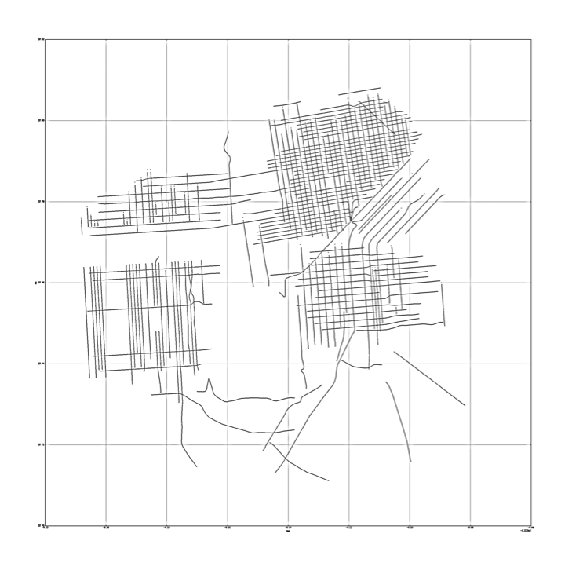
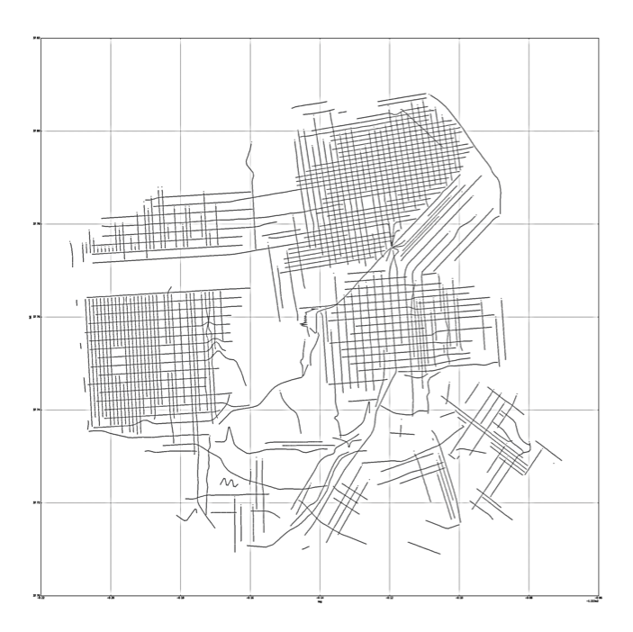
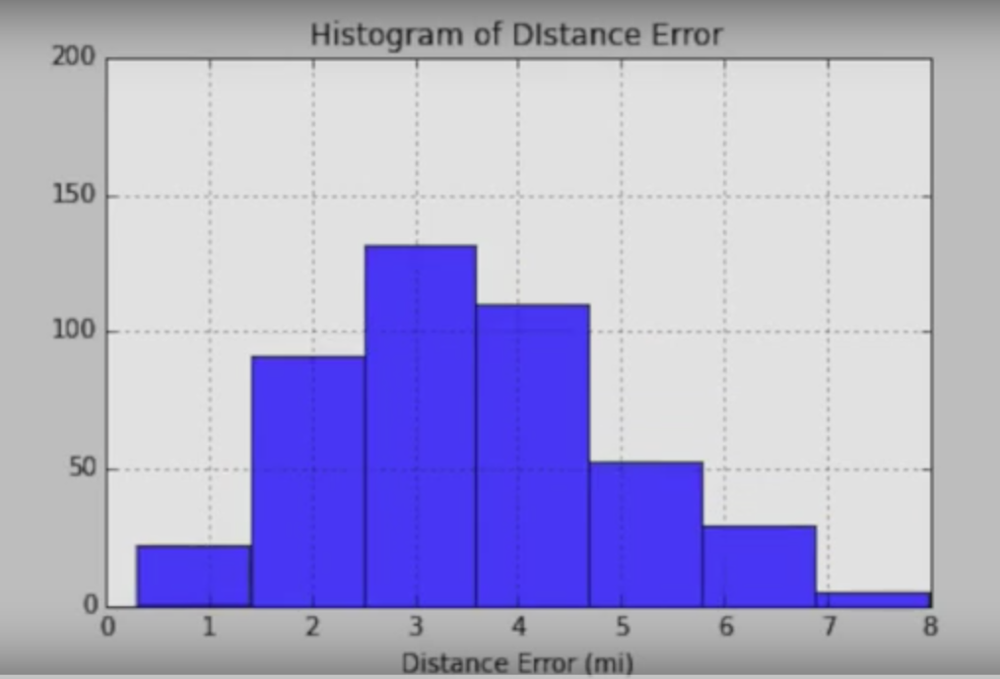
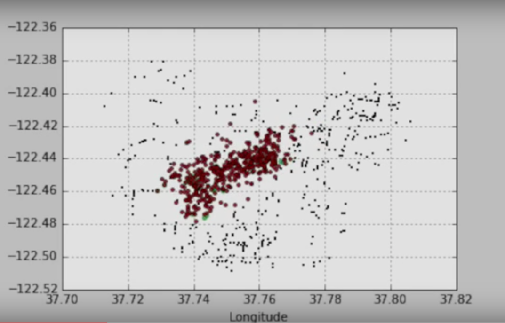

# Locate This View

## Motivations

The idea of estimating image location usign visual features is an inherently rich subject and yet highly unexplored. 
As compared to many other topics in image recognition, geo-recognition requires identification of more key features that remain constant across large spatial scales, making it a challenging and novel task. 

It also represents an integral part of the human experience, where we ourselves possess the innate ability to extract contextual information from the environment in order to draw conclusions about our current location and surroundings. Understanding and achieving visual geo-recognition is therefore crucial towards the development of a more refined and sensitive Artificial Intelligence framework.

In addition of geo-locating images, we would be able to axtract other informatino from scenery images through geo-identification.
Street view images also carry information of propoerties, business locations, news and media that could be directly or indirectly used to add value in various industries. geo-identification can also perform as an laternative to extract geo-tag information from photos, considering the vast majoriy of images do not carry geo-tag information. 

This project is focuse on finding an answer for possibility and accuracy of geo-identifying images. As a result, a Convolutional Neural Network algorithm (LocateThisView) is designed and developed to estimate the exact location of a street view image from San Francisco.

## Data pipeline

Images for training and testing the algorithm is taken from google street view API. I have collected and calculated lat long information of more than 600 streets ranked based on the number of registered businesses in a given street. Latitude and longitude data for intersecitons are extracted from google geolocation API (using intersection of streets as an address parameter). 

Finally, regularly distributed points are interpolated every 100 ft, and images with 4 different angles are scraped from google streetview API. 

##Convolutional Neaual Network model

The convolutional neaural network model is designed using three convolutional layers following with two fully connected hidden layers. Nolearn, a python package developed based on Lasagne and Theano, is selected to develop the neaural network model. 

## Results
The neuaral network algorithm of LocateThis View is trained using more than 60,000 images and tested on a set of streetview images. I have used these test data to record and analyze the predictions of the model at the end of each epoch. Results are presented as graphs and animations, where we clearly observe how the model learns the features of each area and improves its performance. 
Final model results in more than 70% of the points within 1 km radius from the true value (San Francisco is a 10x10 km area). 
Distance error and histogram of error is animated for 300 test points that are tracked during the training of the CNN network:

##References

1. A. R. Zamir and M. Shah. Image Geo-localization based on Multiple Nearest Neighbor Feature Matching using General- ized Graphs. IEEE Transactions on Pattern Analysis and Ma- chine Intelligence (TPAMI), 2014.

2. M. W. Jones. Image geolocation through hierarchical classif- cation and dictionary-based recognition. 2012.

3. B. Zhou, A. Lapedriza, J. Xiao, A. Torralba, and A. Oliva. Learning Deep Features for Scene Recognition using Places Database. NIPS, 2014.
